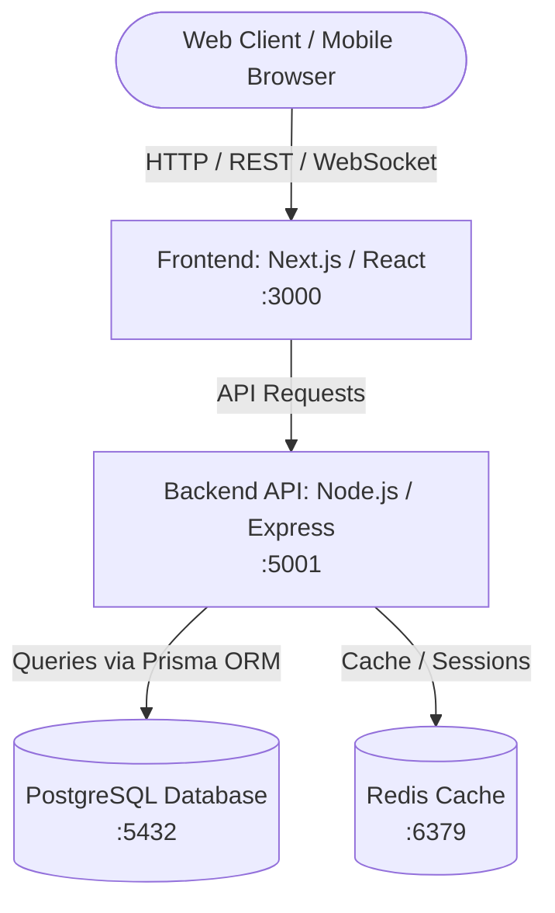
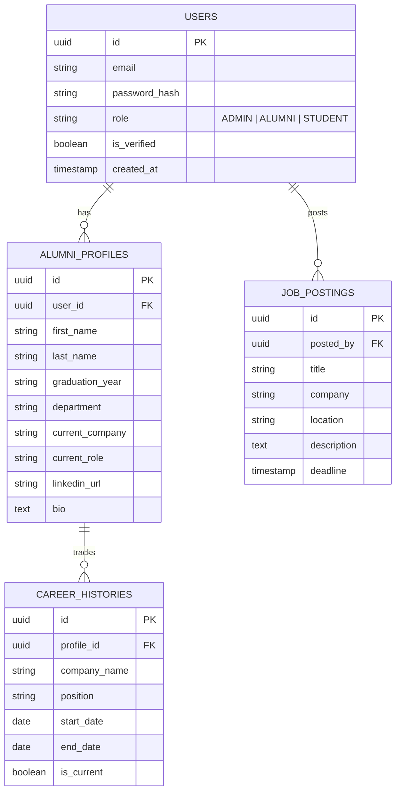

# Alumni Tracking System

A modern, containerized platform designed for universities and educational institutions to maintain lifelong connections with their graduates. The system enables career tracking, mentorship opportunities, networking, job postings, and institutional analytics.

---

## 🚀 Key Features & Modules

- **👤 Alumni Profiles & Career Tracking**:
  - Detailed professional profiles, current company, role, industry, and skills.
  - Academic history (graduation year, department, faculty, GPA/honors).
  - LinkedIn and portfolio integration.
- **🔍 Advanced Search & Directory**:
  - Filter alumni by graduation year, department, industry, current employer, or location.
- **🤝 Mentorship & Networking**:
  - Connect current students with experienced alumni mentors.
  - In-app messaging and meeting requests.
- **💼 Job & Internship Board**:
  - Alumni-exclusive and alumni-posted career opportunities.
- **📅 Events & Reunions**:
  - Event registration, RSVP tracking, and announcement feeds.
- **📊 Admin & Analytics Dashboard**:
  - Employment rate statistics, industry distribution charts, and user verification workflows.
- **🌙 Theme Customization**:
  - Built-in Dark Mode and Light Mode support.

---

## 🛠️ Tech Stack

| Layer | Technology | Description |
| :--- | :--- | :--- |
| **Backend** | **Node.js** (Express / NestJS + TypeScript) | High-performance RESTful API with modular architecture and input validation. |
| **Database** | **PostgreSQL** | Robust relational database for managing structured alumni, career, and event data. |
| **ORM** | **Prisma** | Type-safe database client and automated migration management. |
| **Frontend** | **Next.js / React (TypeScript)** | Responsive, modern web interface with server-side rendering and Dark Mode support. |
| **Cache & Sessions** | **Redis** *(Optional / Recommended)* | High-speed caching for search results, session store, and rate limiting. |
| **Containerization** | **Docker & Docker Compose** | Reproducible multi-container development and production environments. |

---

## 🏛️ System Architecture



---

## 📁 Proposed Project Structure

```text
Alumni/
├── docker-compose.yml          # Multi-container orchestration
├── .env.example                # Sample environment configuration
├── client/                     # Frontend application (Next.js / React)
│   ├── Dockerfile
│   ├── package.json
│   ├── src/
│   │   ├── app/                # Pages and routes
│   │   ├── components/         # Reusable UI components (Navbar, DarkModeToggle, etc.)
│   │   └── styles/
│   └── tsconfig.json
├── server/                     # Backend API (Node.js / Express / NestJS)
│   ├── Dockerfile
│   ├── package.json
│   ├── prisma/                 # Database schema & migrations
│   │   └── schema.prisma
│   ├── src/
│   │   ├── controllers/        # Route controllers
│   │   ├── services/           # Business logic
│   │   ├── routes/             # API route definitions
│   │   └── middlewares/        # Authentication & error handling
│   └── tsconfig.json
└── README.md
```

---

## 🗄️ Database Schema Concept (PostgreSQL)



---

## 🐳 Docker Setup & Quick Start

### Prerequisites
- [Docker Desktop](https://www.docker.com/products/docker-desktop/) (includes Docker Engine & Docker Compose)

### 1. Clone & Configure Environment
```bash
git clone https://github.com/your-username/Alumni.git
cd Alumni
cp .env.example .env
```

### 2. Run with Docker Compose
Start the backend, frontend, and PostgreSQL database with a single command:

```bash
docker compose up --build
```

### 3. Service Endpoints
- **Frontend App**: [http://localhost:3000](http://localhost:3000)
- **Backend API**: [http://localhost:5001/api](http://localhost:5001/api)
- **PostgreSQL**: `localhost:5432`

---

## 🗺️ Development Roadmap

- [ ] **Phase 1: Environment & Architecture Setup**
  - Set up repository structure (`client/`, `server/`).
  - Configure `docker-compose.yml` with Node.js and PostgreSQL.
  - Set up Prisma ORM with initial schema migrations.
- [ ] **Phase 2: Authentication & Core APIs**
  - Implement JWT-based auth (Register, Login, Role-based guards).
  - CRUD operations for Alumni profiles and career histories.
- [ ] **Phase 3: Frontend & Dark Mode UI**
  - Build responsive dashboards with a toggleable Dark / Light theme.
  - Implement searchable alumni directory with filters.
- [ ] **Phase 4: Features & Networking**
  - Job board and mentorship request workflows.
  - Event management and RSVP system.
- [ ] **Phase 5: Deployment & CI/CD**
  - Production Docker builds and automated test suites.
