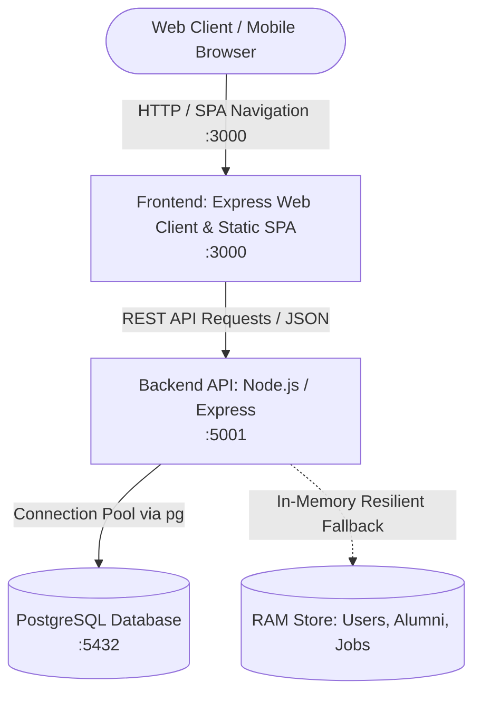
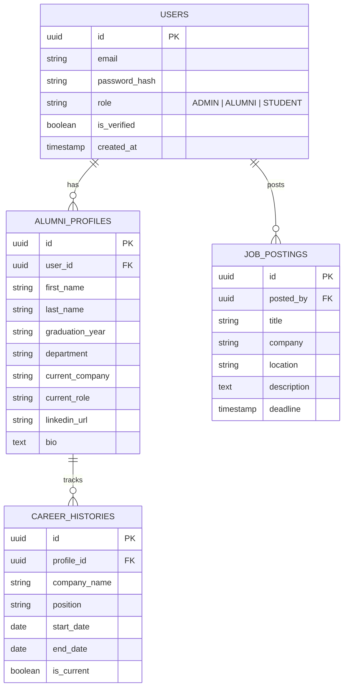

# Alumni Tracking System

A modern, containerized platform designed for universities and educational institutions to maintain lifelong connections with their graduates. The system enables career tracking, mentorship opportunities, networking, job postings, and institutional analytics.

---

## 🚀 Key Features & Modules

- **👤 Alumni Profiles & Career Tracking**:
  - Detailed professional profiles, current company, role, industry, and skills.
  - Academic history (graduation year, department, faculty, GPA/honors).
  - LinkedIn and portfolio integration.
- **🔍 Advanced Search & Directory**:
  - Filter alumni by graduation year, department, industry, current employer, or location.
- **🤝 Mentorship & Networking**:
  - Connect current students with experienced alumni mentors.
  - In-app messaging and meeting requests.
- **💼 Job & Internship Board**:
  - Alumni-exclusive and alumni-posted career opportunities.
- **📅 Events & Reunions**:
  - Event registration, RSVP tracking, and announcement feeds.
- **📊 Admin & Analytics Dashboard**:
  - Employment rate statistics, industry distribution charts, and user verification workflows.
- **🌙 Theme Customization**:
  - Built-in Dark Mode and Light Mode support.

---

## 🛠️ Tech Stack

| Layer | Technology | Description |
| :--- | :--- | :--- |
| **Backend** | **Node.js** (Express / NestJS + TypeScript) | High-performance RESTful API with modular architecture and input validation. |
| **Database** | **PostgreSQL** | Robust relational database for managing structured alumni, career, and event data. |
| **ORM** | **Prisma** | Type-safe database client and automated migration management. |
| **Frontend** | **Next.js / React (TypeScript)** | Responsive, modern web interface with server-side rendering and Dark Mode support. |
| **Cache & Sessions** | **Redis** *(Optional / Recommended)* | High-speed caching for search results, session store, and rate limiting. |
| **Containerization** | **Docker & Docker Compose** | Reproducible multi-container development and production environments. |

---

## 🏛️ System Architecture


```mermaid
graph TD
    User([Web Client / Mobile Browser]) -->|HTTP / SPA Navigation :3000| Frontend[Frontend: Express Web Client & Static SPA\n:3000]
    Frontend -->|REST API Requests / JSON| Backend[Backend API: Node.js / Express\n:5001]
    Backend -->|Connection Pool via pg| DB[(PostgreSQL Database\n:5432)]
    Backend -.->|In-Memory Resilient Fallback| RAMStore[(RAM Store: Users, Alumni, Jobs)]
```

---

## 🏗️ MVC (Model-View-Controller) Architecture

The Alumni Tracking System (AlumniSphere) is architected around the industry-standard **MVC (Model-View-Controller)** pattern. This architectural pattern strictly decouples data persistence and state management (Model), user interface and presentation (View), and routing, request dispatching, and business logic (Controller)—ensuring high maintainability, modularity, and testability.

### 🔄 MVC Components & Interaction Diagram

```mermaid
graph TD
    subgraph ViewLayer ["🖥️ VIEW (Presentation & UI Layer)"]
        HTML["client/public/index.html\n(SPA Dashboard, Modals, Metric Cards)"]
        CSS["client/public/styles.css\n(Glassmorphism, Dark/Light Mode Themes)"]
        ClientRender["client/public/app.js (Render Methods)\n(renderAlumniList, renderJobsList, renderStats)"]
        SSRUsers["server/src/index.js: renderUsersPage()\n(User Management HTML Interface & CRUD Table)"]
        SSRSwagger["server/src/index.js: renderSwaggerUI()\n(Interactive OpenAPI / Swagger UI Interface)"]
        SSRHomepage["server/src/index.js: handleHomepage()\n(Standalone Landing & About View)"]
    end

    subgraph ControllerLayer ["⚙️ CONTROLLER (Routing & Business Logic)"]
        ServerCtrl["server/src/index.js (API Handlers)\n- Users CRUD: GET, POST, PUT, PATCH, DELETE\n- Alumni Controller: Search, Filter, Registration\n- Jobs, Stats, Health & Calculator Handlers"]
        ClientServerCtrl["client/server.js\n- Static Asset File Server (express.static)\n- Swagger Reverse Redirect (/api/swagger)\n- SPA Fallback Route Controller (GET *)"]
        ClientEventCtrl["client/public/app.js (Event & API Handlers)\n- Dynamic Filter & Search Listeners\n- Modal & Theme State Handlers\n- Async Fetch API Dispatchers"]
    end

    subgraph ModelLayer ["🗄️ MODEL (Data & State Management)"]
        PG["PostgreSQL Database\n(pg.Pool Connection Pool)"]
        RAM_Users["In-Memory Users Store\n(inMemoryUsers Collection)"]
        RAM_Alumni["In-Memory Alumni Catalog\n(mockAlumni Collection)"]
        RAM_Jobs["In-Memory Jobs & Stats Store\n(mockJobs, Platform Metrics)"]
        ClientState["Client Reactive State\n(alumniData, activeTab, theme)"]
    end

    %% Interaction Lifecycle
    User([👤 End User / Web Browser]) -->|1. UI Interaction (Click, Input, Form Submit)| ViewLayer
    ViewLayer -->|2. Event Trigger / Async API Fetch Call| ControllerLayer
    ControllerLayer -->|3. Data Validation, Query & Mutation (CRUD)| ModelLayer
    ModelLayer -->|4. Data Result / State Update| ControllerLayer
    ControllerLayer -->|5. JSON Payload or Server-Rendered HTML| ViewLayer
    ViewLayer -->|6. DOM Re-render & Dynamic Notifications| User
```

---

### 📁 Directory, Folder & File Map (Directories, Folders & Files)

All directories, folders, and files across the repository are annotated with their designated role in the MVC architecture:

```text
Alumni/
├── client/                                  # 🖥️ [VIEW & CLIENT CONTROLLER] Frontend Client Service
│   ├── public/                              # 🎨 [VIEW] Client Presentation & Static Assets
│   │   ├── index.html                       # 📄 [VIEW] Main Single Page Application (SPA) HTML Layout
│   │   ├── styles.css                       # 🎨 [VIEW] Glassmorphism Design System, Dark/Light Themes
│   │   └── app.js                           # ⚙️ [CONTROLLER & VIEW RENDERER] Client Logic & DOM Renderer
│   ├── server.js                            # ⚙️ [CONTROLLER] Frontend Web Server & Reverse Router (Port 3000)
│   ├── Dockerfile                           # 🐳 [INFRA] Frontend Container Definition (Node.js 18-alpine)
│   ├── package.json                         # 📦 [CONFIG] Frontend Dependencies (express) & Scripts
│   └── package-lock.json                    # 🔒 [CONFIG] Dependency Lockfile
├── server/                                  # ⚙️ [CONTROLLER & MODEL] Backend API & Data Service
│   ├── src/                                 # 📂 [CONTROLLER, MODEL & SSR VIEW] Backend Source Code
│   │   ├── controllers/                     # ⚙️ [CONTROLLER] Application Controllers Layer
│   │   │   ├── index.js                     # ⚙️ [CONTROLLER] Barrel Export for Controllers
│   │   │   ├── user.controller.js           # ⚙️ [CONTROLLER & SSR VIEW] Web / HTML User Controller
│   │   │   └── api-user.controller.js       # ⚙️ [CONTROLLER] Pure JSON REST API User Controller
│   │   ├── models/                          # 🗄️ [MODEL] Data Models & Repository Layer
│   │   │   ├── index.js                     # 🗄️ [MODEL] Barrel Export for Models
│   │   │   └── user.model.js                # 🗄️ [MODEL] In-Memory User Model with Full CRUD Operations
│   │   └── index.js                         # 🧠 [ROUTER & CORE SERVER] Primary API Server (Port 5001)
│   ├── Dockerfile                           # 🐳 [INFRA] Backend API Container Definition
│   ├── package.json                         # 📦 [CONFIG] Backend Dependencies (express, cors, dotenv, pg)
│   └── package-lock.json                    # 🔒 [CONFIG] Dependency Lockfile
├── postman/                                 # 🧪 [TEST & DOCS] API Testing Collections & Environments
│   ├── collections/                         # API Request Blueprints (CRUD test scenarios)
│   └── globals/                             # Postman Global Workspace Variables
├── homepage.js                              # 📄 [CONTROLLER & SSR VIEW] Standalone Lightweight Server Script (Port 3000)
├── docker-compose.yml                       # 🐳 [INFRA] Multi-Container Orchestration (db, server, client)
├── package.json                             # 📦 [CONFIG] Root Workspace Automation Scripts
├── .env / .env.example                      # ⚙️ [CONFIG] Environment Variables (DATABASE_URL, Ports)
└── README.md                                # 📖 [DOCS] Architecture, MVC Blueprint & API Documentation
```

---

### 📊 MVC Role & Responsibility Matrix

| Directory / Folder / File | MVC Role | Layer | Responsibility & Scope |
| :--- | :--- | :--- | :--- |
| `server/src/models/user.model.js` | **Model (M)** | Backend | Standalone in-memory User entity repository with full CRUD operations (`create`, `findAll`, `findById`, `findByEmail`, `update`, `patch`, `delete`, `count`, `reset`), without requiring a database. |
| `server/src/controllers/api-user.controller.js` | **Controller (C)** | Backend | Pure JSON RESTful API controller; handles API CRUD workflows (`getAll`, `getById`, `create`, `update`, `patch`, `delete`, `count`) with standard HTTP status codes. |
| `server/src/controllers/user.controller.js` | **Controller (C) & SSR View (V)** | Backend | Web/HTML controller; renders the interactive user management dashboard (`renderUsersPage`), processes web form submissions, and powers inline CRUD interactions. |
| `server/src/index.js` (Data Entities) | **Model (M)** | Backend | PostgreSQL connection pool (`pg.Pool`), in-memory catalogs (`mockAlumni`, `mockJobs`), and metric calculation aggregators. |
| `client/public/app.js` (State Variables) | **Model (M)** | Frontend | Client-side reactive state model (`alumniData`, `activeTab`, `alumni_theme`, modal form states). |
| `client/public/index.html` | **View (V)** | Frontend | Primary user interface template: Navbar, live status pills, hero section, statistics counter cards, search/filter bars, tab views, modal dialogues, and toast notifications. |
| `client/public/styles.css` | **View (V)** | Frontend | Visual styling system: CSS variable design tokens for Dark/Light modes, glassmorphism backdrop blurs, responsive CSS Grid layouts, and animations. |
| `client/public/app.js` (Render Methods) | **View (V)** | Frontend | Dynamic DOM rendering logic: `renderAlumniList()`, `renderJobsList()`, `renderStats()`, `showNotification()`, `openModal()`, `closeModal()`. |
| `server/src/controllers/user.controller.js` (HTML UI) | **View (V)** | Backend | Server-side rendered HTML dashboard: `renderUsersPage()` featuring inline edit/delete prompt triggers, responsive table, and live alert banners. |
| `server/src/index.js` (SSR Templates) | **View (V)** | Backend | Server-side rendered HTML templates: `renderSwaggerUI()` (Swagger UI view), `handleHomepage()`, `handleSum()`. |
| `server/src/index.js` (Router & Dispatcher) | **Controller (C)** | Backend | Central application router mounting API endpoints, delegating user routes to controllers, content negotiation, and error handling. |
| `client/server.js` | **Controller (C)** | Frontend | Express web server; static file delivery (`express.static`), health monitoring (`/api/health`), documentation redirection (`/api/swagger`), and SPA fallback routing (`GET *`). |
| `client/public/app.js` (Event & Fetch) | **Controller (C)** | Frontend | Event interception (`keyup`, `change`, `submit`, `click`), form input validation, and asynchronous backend communication via `fetch()`. |
| `homepage.js` | **Controller & SSR View** | Root | Standalone server script (`npm run homepage`) serving `/homepage`, `/api/users`, and `/api/health` endpoints with embedded HTML views. |
| `docker-compose.yml` | **Infrastructure (Infra)** | DevOps | Orchestrates Model (PostgreSQL), Controller (Node.js API), and View (Frontend Client) in isolated container networks. |

---

### 🧠 In-Depth Layer Breakdown

#### 1. Model (M) - Data, Entities & State Management
The Model layer oversees business entities, validation rules, data stores, and persistence mechanisms:
- **Database Persistence (PostgreSQL Connection Pool)**:
  - Managed via `pg.Pool` inside `server/src/index.js`.
  - Maps relational entities; defines relationships between `USERS`, `ALUMNI_PROFILES`, `CAREER_HISTORIES`, and `JOB_POSTINGS`.
- **Resilient In-Memory Data Models (RAM Store)**:
  - Ensures continuous availability during testing or before the database container is initialized:
    - **User Model (`server/src/models/user.model.js`)**: Encapsulates all User CRUD operations (`create`, `findAll`, `findById`, `findByEmail`, `update`, `patch`, `delete`, `count`, `reset`, `clear`), automatic ID sequencing, validation, role constraints, and ISO timestamps.
    - **Alumni Model (`mockAlumni`)**: Graduation year, company, role, industry, technical skills array (`skills`), avatar, bio, and mentorship status (`isMentor`).
    - **Job Model (`mockJobs`)**: Opportunity title, company, location, employment type, poster, and application deadline.
- **Client-Side Reactive State (Client State)**:
  - `client/public/app.js` holds active filtering state, `alumniData` cache, current tab selection, and user theme preferences in `localStorage`.

#### 2. View (V) - Presentation & User Interface Layer
The View layer delivers an interactive, modern, and accessible user experience:
- **Single Page Application (SPA) Views**:
  - `client/public/index.html`: Structured with semantic HTML5 elements. Features live architecture status pills (API, PostgreSQL, Docker), responsive hero section, multi-criteria filters, tab navigation, and registration modals.
  - `client/public/styles.css`: Crafted with CSS Custom Properties, sleek glassmorphism effects, Dark / Light mode color schemes, and micro-animations.
- **Client-Side Dynamic DOM Rendering**:
  - `client/public/app.js`: Consumes API JSON payloads and dynamically generates DOM nodes using `renderAlumniList()`, `renderJobsList()`, and `renderStats()`.
- **Server-Side Rendered (SSR) Views**:
  - `renderUsersPage()` in `server/src/controllers/user.controller.js`: Interactive HTML dashboard for `/users` and browser `/api/users` featuring inline edit (`✏️ Edit` via PUT/PATCH) and delete (`🗑️ Delete` via DELETE) controls, live alert notices, and a user registration form.
  - `renderSwaggerUI()`: Embedded Swagger UI client presenting the OpenAPI 3.0 specification (`/api/swagger`).
  - `handleHomepage()` & `handleSum()`: Dedicated server-rendered HTML presentation pages.

#### 3. Controller (C) - Routing, Business Logic & Request Dispatching
The Controller layer handles client requests, enforces input validation, mutates or queries Models, and formats output views:
- **Dedicated User Controllers (`server/src/controllers/`)**:
  - **`ApiUserController` (`server/src/controllers/api-user.controller.js`)**:
    - `getAll`: Retrieves all users in JSON, supporting query filters (`role`, `department`, `search`).
    - `getById`: Returns a single user by ID as JSON (`200 OK`) or `404 Not Found`.
    - `create`: Validates payload (`name`, `email`), delegates to `UserModel.create()`, and returns `201 Created` with the new user object.
    - `update`: Handles full updates (`PUT`) and partial updates (`PATCH`), returning updated user JSON.
    - `delete`: Deletes a user by ID and returns remaining user count.
    - `count`: Quick endpoint returning current user count.
  - **`UserController` (`server/src/controllers/user.controller.js`)**:
    - `index`: Renders the full interactive HTML management dashboard (`renderUsersPage`).
    - `show`: Displays single user details page.
    - `create`: Processes HTML form submissions (`POST /users`), re-rendering with alerts.
    - `update`: Handles web updates via modal prompts or PUT/PATCH requests.
    - `delete`: Handles web deletion via inline action buttons.
- **Other Controllers & Handlers (`server/src/index.js`)**:
  - **Alumni Controller**: `GET /api/alumni` (multi-filter search), `POST /api/alumni` (alumni registration).
  - **Jobs & Analytics Controllers**: `GET /api/stats` (employment rates, metrics), `GET /api/jobs` (opportunities).
  - **System & Swagger Controllers**: `handleHealth` (status check), `handleSwagger` (OpenAPI schema & UI).
- **Frontend Web Server Controller (`client/server.js`)**:
  - Serves static assets via `express.static`, redirects documentation traffic to the API server, and forwards unknown routes to `index.html` for client-side routing.
- **Client Event Controllers (`client/public/app.js`)**:
  - Attaches event listeners (`keyup`, `change`, `submit`, `click`) to trigger filter recalculations, modal toggles, theme switching, and asynchronous `fetch()` API calls.

---

### 🔁 End-to-End MVC Request Lifecycle Examples

#### Scenario 1: Alumni Search & Filter Flow
1. **View**: User types `"Google"` into the search bar or selects `"Computer Engineering"` from the department dropdown.
2. **Client Controller (`app.js`)**: Captures the `keyup` or `change` event and dispatches an asynchronous `GET /api/alumni?search=google&department=...` request.
3. **Backend Controller (`server/src/index.js`)**: Intercepts the route and extracts query parameters from `req.query`.
4. **Model (`mockAlumni` / PostgreSQL)**: Filters records based on query parameters and returns the matched entities.
5. **Backend Controller**: Formats the filtered records as JSON and responds with HTTP status 200.
6. **Client Controller / View (`app.js`)**: Receives the JSON response, passes it to `renderAlumniList()`, and injects dynamically formatted HTML cards into `#alumniGrid`.

#### Scenario 2: In-Memory User Creation & Mutation (CRUD Flow)
1. **View (`renderUsersPage`)**: User completes the form (Name, Email, Role, Department) and clicks "Save & Submit".
2. **Controller (`handleCreateUser`)**: Receives the `POST /api/users` request and validates `name` and `email` fields.
3. **Model (`inMemoryUsers`)**: Constructs a new user record and prepends it to the in-memory array.
4. **Controller -> View**: Based on request headers, returns a JSON object (for asynchronous SPA calls) or re-renders the HTML table with a green success banner (`alert-success`).

---

## 🗄️ Database Schema Concept (PostgreSQL)


```mermaid
erDiagram
    USERS ||--o{ ALUMNI_PROFILES : has
    USERS {
        uuid id PK
        string email
        string password_hash
        string role "ADMIN | ALUMNI | STUDENT"
        boolean is_verified
        timestamp created_at
    }

    ALUMNI_PROFILES ||--o{ CAREER_HISTORIES : tracks
    ALUMNI_PROFILES {
        uuid id PK
        uuid user_id FK
        string first_name
        string last_name
        string graduation_year
        string department
        string current_company
        string current_role
        string linkedin_url
        text bio
    }

    CAREER_HISTORIES {
        uuid id PK
        uuid profile_id FK
        string company_name
        string position
        date start_date
        date end_date
        boolean is_current
    }

    USERS ||--o{ JOB_POSTINGS : posts
    JOB_POSTINGS {
        uuid id PK
        uuid posted_by FK
        string title
        string company
        string location
        text description
        timestamp deadline
    }
```

---

## 🐳 Docker Setup & Quick Start

### Prerequisites
- [Docker Desktop](https://www.docker.com/products/docker-desktop/) (includes Docker Engine & Docker Compose)

### 1. Clone & Configure Environment
```bash
git clone https://github.com/your-username/Alumni.git
cd Alumni
cp .env.example .env
```

### 2. Run with Docker Compose
Start the backend, frontend, and PostgreSQL database with a single command:

```bash
docker compose up --build
```

### 3. Service Endpoints
- **Frontend App**: [http://localhost:3000](http://localhost:3000)
- **Backend API**: [http://localhost:5001/api](http://localhost:5001/api)
- **Swagger API Documentation**: [http://localhost:5001/api/swagger](http://localhost:5001/api/swagger)
- **User Management Interface**: [http://localhost:5001/api/users](http://localhost:5001/api/users)
- **System Health Check**: [http://localhost:5001/api/health](http://localhost:5001/api/health)
- **PostgreSQL Database**: `localhost:5432`

---

## 📖 API Documentation (Swagger / OpenAPI)

All RESTful API endpoints across the project are defined according to the OpenAPI 3.0 standard and exposed via an interactive, modern **Swagger UI** interface for seamless in-browser testing and schema inspection.

- **Swagger UI (Interactive Interface)**: [http://localhost:5001/api/swagger](http://localhost:5001/api/swagger)
- **OpenAPI JSON Schema**: [http://localhost:5001/api/swagger?format=json](http://localhost:5001/api/swagger?format=json) or [http://localhost:5001/api/swagger.json](http://localhost:5001/api/swagger.json)

### Available API Endpoints

| Method | Endpoint | Description |
| :--- | :--- | :--- |
| `GET` | `/api/swagger` | Interactive Swagger UI interface and API documentation |
| `GET` | `/api/swagger?format=json` | Raw OpenAPI 3.0.3 JSON schema |
| `GET` | `/api/health` | Server and database JSON health status report |
| `GET` | `/api/users` | List all users (Interactive HTML dashboard or `?format=json`) |
| `POST` | `/api/users` | Create a new user without database requirement (RAM store) |
| `GET` | `/api/user/{id}` | Query a specific user by ID |
| `PUT` | `/api/user/{id}` | Fully update user attributes (`name`, `email`, `role`, `department`) |
| `PATCH` | `/api/user/{id}` | Partially update user attributes |
| `DELETE` | `/api/users/{id}` | Delete a user from in-memory store by ID |
| `GET` | `/api/alumni` | Filter and list alumni profiles (`search`, `department`, `year`, `mentorOnly`) |
| `POST` | `/api/alumni` | Register a new alumni profile |
| `GET` | `/api/stats` | Platform statistics (total alumni, employment rate, industry breakdown) |
| `GET` | `/api/jobs` | Career and internship opportunities list |
| `GET` | `/sum` | Calculate sum of two numbers (`?number1=X&number2=Y`) or interactive form |
| `GET` | `/homepage` | Standalone landing page and about view |

#### Testing with cURL:
```bash
# Retrieve Swagger UI HTML
curl -i http://localhost:5001/api/swagger

# Retrieve OpenAPI JSON schema
curl -s http://localhost:5001/api/swagger?format=json | jq .
```

---

## 🗺️ Development Roadmap

- [ ] **Phase 1: Environment & Architecture Setup**
  - Set up repository structure (`client/`, `server/`).
  - Configure `docker-compose.yml` with Node.js and PostgreSQL.
  - Set up Prisma ORM with initial schema migrations.
- [ ] **Phase 2: Authentication & Core APIs**
  - Implement JWT-based auth (Register, Login, Role-based guards).
  - CRUD operations for Alumni profiles and career histories.
- [ ] **Phase 3: Frontend & Dark Mode UI**
  - Build responsive dashboards with a toggleable Dark / Light theme.
  - Implement searchable alumni directory with filters.
- [ ] **Phase 4: Features & Networking**
  - Job board and mentorship request workflows.
  - Event management and RSVP system.
- [ ] **Phase 5: Deployment & CI/CD**
  - Production Docker builds and automated test suites.
